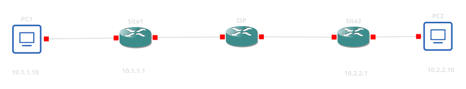

# 🛡️ GRE over IPsec (IKEv1) con Enrutamiento Dinámico (OSPF) en Cisco

## 👤 Perfil del Autor
- **Ingeniero/Desarrollador:** Edgardy Olivero Flores
- **Especialidad:** Seguridad Informática y Redes

## 🗺️ Arquitectura de Red


## ⚙️ Resumen Técnico
Este repositorio documenta el diseño y despliegue de una solución **GRE over IPsec** utilizando **IKEv1** en infraestructura Cisco vIOS, solucionando las limitaciones inherentes de IPsec frente al tráfico multicast.

Dado que el protocolo IPsec puro no es capaz de cifrar tráfico multicast o broadcast, impide la ejecución nativa de protocolos de enrutamiento dinámico. La arquitectura de este laboratorio resuelve este problema implementando un túnel **GRE (Generic Routing Encapsulation)** que encapsula el tráfico OSPF junto con los datos de la LAN. Posteriormente, todo el túnel GRE es protegido criptográficamente por IPsec operando estratégicamente en **Modo Transporte**, lo que evita la duplicación innecesaria de cabeceras IP y optimiza el *overhead* de la red.

### 🔐 Diseño Criptográfico y Encapsulación
La seguridad y el transporte se estructuraron de la siguiente manera:
* **Fase 1 (ISAKMP / IKEv1):** * Cifrado: AES-256
  * Integridad: SHA-256
  * Diffie-Hellman: Grupo 14
  * Autenticación: Pre-Shared Key (PSK)
* **Fase 2 (IPsec en Modo Transporte):** * A diferencia de las VPN tradicionales en Modo Túnel, el *transform-set* se configura en `mode transport`. Esto garantiza que solo se encripte el *payload* GRE sin generar una nueva cabecera IP exterior, maximizando el MTU útil.
* **Enrutamiento Dinámico:** * **OSPFv2 (Área 0)** se habilitó directamente sobre las interfaces lógicas (`Tunnel0`) para el aprendizaje automático de las subredes de cada Site, eliminando la dependencia de rutas estáticas.

## 🛠️ Flujo de Despliegue
La implementación en la CLI de Cisco se llevó a cabo bajo un enfoque modular:
1. **Infraestructura y Conectividad Perimetral:** Direccionamiento base y ruteo predeterminado hacia la nube del ISP.
2. **Negociación ISAKMP:** Construcción de las políticas de intercambio y el *Keyring*.
3. **Protección IPsec:** Definición de los algoritmos ESP de Fase 2 (Modo Transporte) y empaquetamiento en un `ipsec profile`.
4. **Construcción del Túnel GRE:** Despliegue de la interfaz lógica punto a punto, definición de la encapsulación subyacente y aplicación del perfil criptográfico.
5. **Inyección OSPF:** Activación de los procesos de enrutamiento dinámico (`ip ospf 1 area 0`) para establecer adyacencias seguras a través del túnel VPN.

## 🔍 Auditoría y Diagnóstico
Comandos críticos de auditoría utilizados para validar el establecimiento del túnel, la adyacencia de enrutamiento y la integridad del cifrado:

```ios
! Verificar el establecimiento de la adyacencia OSPF a través de la VPN
show ip ospf neighbor

! Validar la tabla de enrutamiento (buscar rutas inyectadas con 'O')
show ip route ospf

! Confirmar la negociación IKEv1 (Estado: QM_IDLE)
show crypto isakmp sa

! Confirmar la encapsulación IPsec y la aplicación correcta del Modo Transporte
show crypto ipsec sa
